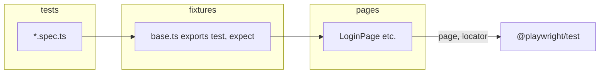

# Playwright Framework Guide

This document describes **this repository’s layout**, gives a **structured map of Playwright’s APIs** (with pointers to the full reference), and summarizes **TypeScript concepts** that matter most when writing and maintaining tests.

For the authoritative, always-up-to-date API listing, use the official docs: [Playwright API](https://playwright.dev/docs/api/class-playwright).

---

## Table of contents

1. [This project’s structure](#1-this-projects-structure)
2. [Configuration & workflow](#2-configuration--workflow)
3. [Playwright concepts & methods (by area)](#3-playwright-concepts--methods-by-area)
4. [TypeScript essentials for test automation](#4-typescript-essentials-for-test-automation)
5. [Further reading](#5-further-reading)

---

## 1. This project’s structure

### Directory layout

```
Playwright/
├── docs/
│   └── FRAMEWORK_AND_REFERENCE.md    # This guide
├── fixtures/
│   └── base.ts                       # Extended `test` + shared fixtures (e.g. `loginPage`)
├── pages/
│   └── LoginPage.ts                  # Page Object (locators + actions)
├── tests/
│   ├── auth/
│   │   └── login.spec.ts             # Feature-area specs (uses `@fixtures/base`)
│   └── smoke/
│       └── playwright-docs.spec.ts   # Smoke / external-site checks
├── playwright.config.ts              # Runner, projects, timeouts, reporters
├── tsconfig.json                     # TypeScript + path aliases (`@pages/*`, `@fixtures/*`)
├── package.json                      # Scripts (`test`, `test:ui`, etc.)
├── .env.example                      # Optional `BASE_URL` documentation
└── .github/workflows/playwright.yml  # CI: install browsers, run Chromium, artifacts
```

### How pieces fit together



- **Specs** live under `tests/` and import `test` / `expect` from `@fixtures/base` when they need shared fixtures (like `loginPage`).
- **Page Objects** in `pages/` encapsulate URLs, locators, and user flows so specs stay short and readable.
- **`fixtures/base.ts`** uses `test.extend()` to register typed fixtures; specs get autocomplete for `{ loginPage }` in the test callback.
- **`playwright.config.ts`** sets global defaults: `baseURL`, timeouts, reporters, projects (Chromium / Firefox), CI vs local behavior.

### Path aliases (`tsconfig.json`)

| Alias          | Maps to        | Example import                          |
|----------------|----------------|-----------------------------------------|
| `@pages/*`     | `pages/*`      | `import { LoginPage } from '@pages/LoginPage'` |
| `@fixtures/*`  | `fixtures/*`   | `import { test, expect } from '@fixtures/base'` |

---

## 2. Configuration & workflow

### `playwright.config.ts` (high level)

| Setting            | Role |
|--------------------|------|
| `testDir`          | Root folder for `*.spec.ts` files |
| `fullyParallel`    | Parallelize tests across files/workers where safe |
| `forbidOnly`       | Fail CI if `.only` is left on tests |
| `retries`          | Retry flaky tests (typically in CI) |
| `workers`          | Concurrency; often `1` in CI for stability |
| `reporter`         | Human output + HTML; CI adds GitHub + JUnit |
| `use`              | Browser defaults: `baseURL`, `headless`, trace, screenshot, video, timeouts |
| `expect.timeout`   | Default timeout for `expect` assertions |
| `timeout`          | Per-test timeout |
| `projects`         | Separate runs per browser/device preset |

### npm scripts (`package.json`)

| Script          | Purpose |
|-----------------|--------|
| `npm test`      | Run all projects (Chromium + Firefox by default) |
| `npm run test:chromium` | Run Chromium project only |
| `npm run test:ci` | CI-like env (`CI=1`) + Chromium |
| `npm run test:headed` | Force headed browsers |
| `npm run test:ui` | Playwright UI mode |
| `npm run test:debug` | Inspector / step debugging |
| `npm run report` | Open last HTML report |
| `npm run codegen` | Launch codegen helper |

### Environment

- **`BASE_URL`**: Prepended to relative navigations (`page.goto('/')`). Default in config targets Sauce Demo for login flows; override via `.env` or shell when testing another environment.
- **`CI`**: When set (e.g. GitHub Actions), config enables headless mode, stricter behavior, and CI-oriented reporters.

---

## 3. Playwright concepts & methods (by area)

Playwright is large; treat this section as a **curriculum-style map**. Every class has many methods—use the linked official pages for the full list.

### 3.1 Test runner (`@playwright/test`)

| Topic | What it’s for | Representative APIs |
|-------|----------------|------------------------|
| Declaring tests | Structure and isolation | `test()`, `test.describe()`, `test.only`, `test.skip`, `test.fixme` |
| Hooks | Setup/teardown | `test.beforeAll`, `test.afterAll`, `test.beforeEach`, `test.afterEach` |
| Assertions | Hard vs soft checks | `expect()` from `@playwright/test` — [Assertions](https://playwright.dev/docs/test-assertions) |
| Soft assertions | Collect failures, continue test | `expect.soft()` |
| Annotations | Metadata / filtering | `test.info()`, tags, `test.step()` |
| Parallelism | Control file/worker behavior | `test.describe.configure({ mode: 'serial' })`, worker-scoped fixtures |

**Fixture pattern (this repo):**

- `test.extend<{ loginPage: LoginPage }>({ ... })` — injects `loginPage` into every test that imports your extended `test`.

Reference: [Writing tests](https://playwright.dev/docs/writing-tests), [Fixtures](https://playwright.dev/docs/test-fixtures).

### 3.2 `Browser`, `BrowserContext`, `Page`

| Layer | Responsibility | Common methods / properties |
|-------|------------------|-----------------------------|
| **Browser** | Launches browser process | `browser.newContext()`, `browser.version()` — [Browser](https://playwright.dev/docs/api/class-browser) |
| **BrowserContext** | Incognito-like session; cookies, permissions, storage | `context.newPage()`, `context.grantPermissions()`, `context.storageState()` — [BrowserContext](https://playwright.dev/docs/api/class-browsercontext) |
| **Page** | One tab | Navigation, locators, dialogs, frames — [Page](https://playwright.dev/docs/api/class-page) |

**`Page` — navigation & lifecycle (representative)**

- Navigation: `goto`, `reload`, `goBack`, `goForward`, `close`
- URL / title: `url()`, `title()`
- Waiting: `waitForLoadState`, `waitForURL`, `waitForTimeout` (avoid when a condition-based wait exists)
- Viewport / mobile: `setViewportSize`
- Emulation: `emulateMedia`, `setExtraHTTPHeaders`
- Screenshots / PDF: `screenshot`, `pdf`
- JavaScript: `evaluate`, `evaluateHandle`, `addInitScript`
- Popups: `expectPopup` pattern via `page.waitForEvent('popup')` or similar

### 3.3 Locators (preferred over raw selectors)

Built via `page.locator()`, `page.getByRole`, `getByText`, `getByLabel`, etc.

| Category | Examples |
|----------|-----------|
| Creation | `locator()`, `getByRole()`, `getByText()`, `getByLabel()`, `getByPlaceholder()`, `getByTestId()` |
| Actions | `click()`, `dblclick()`, `fill()`, `press()`, `hover()`, `selectOption()`, `check()`, `uncheck()`, `setInputFiles()` |
| Queries | `count()`, `first()`, `last()`, `nth()`, `filter()` |
| Assertions (async) | `isVisible()`, `isEnabled()`, `textContent()`, `innerText()`, `getAttribute()` |

Locators auto-wait and retry until timeout. Prefer **user-facing** selectors (`getByRole`, `getByLabel`) and stable **`data-testid`** / `data-test` attributes.

Reference: [Locators](https://playwright.dev/docs/locators), [Locator](https://playwright.dev/docs/api/class-locator).

### 3.4 Auto-waiting & timeouts

- **Actions** (click, fill, …) wait for element to be actionable.
- **Assertions** (`expect(locator)`) have retry semantics until timeout.
- Configure defaults in `playwright.config.ts` (`actionTimeout`, `navigationTimeout`, `expect.timeout`, test `timeout`).

### 3.5 Frames, dialogs, downloads

| Area | Class / concept | Notes |
|------|------------------|-------|
| Iframes | `frameLocator()`, `page.frame()` | Prefer `frameLocator` for stable chaining |
| Dialogs | `dialog` event, `on('dialog')`, `page.once('dialog')` | Must handle or dismiss before continuing |
| Downloads | `page.waitForEvent('download')`, `Download` | Save with `download.saveAs()` |

References: [Frames](https://playwright.dev/docs/frames), [Dialogs](https://playwright.dev/docs/dialogs), [Downloads](https://playwright.dev/docs/downloads).

### 3.6 Network

| API | Use |
|-----|-----|
| `page.route()` | Intercept / mock / stub HTTP |
| `page.waitForResponse()`, `page.waitForRequest()` | Synchronize on network |
| `request` fixture | **API-only** tests without a page — [APIRequestContext](https://playwright.dev/docs/api/class-apirequestcontext) |

Reference: [Network](https://playwright.dev/docs/network).

### 3.7 Test artifacts & debugging

| Feature | Config / API |
|---------|----------------|
| Trace | `trace: 'on-first-retry'`, `trace: 'retain-on-failure'` |
| Screenshot | `screenshot: 'only-on-failure'` |
| Video | `video: 'on-first-retry'` |
| HTML report | `npx playwright show-report` |

Reference: [Trace viewer](https://playwright.dev/docs/trace-viewer).

### 3.8 CLI (often used)

| Command | Purpose |
|---------|---------|
| `npx playwright test` | Run tests |
| `npx playwright test path/to/spec.ts` | Single file |
| `npx playwright test -g "pattern"` | Filter by title regex |
| `npx playwright test --project=chromium` | One project |
| `npx playwright codegen URL` | Generate locators and code |

---

## 4. TypeScript essentials for test automation

### 4.1 Why TypeScript here

- Catches typos in fixture names and page object methods before runtime.
- Documents contracts (what a `LoginPage` exposes).
- Plays well with `@playwright/test` types (`Page`, `Locator`, `APIRequestContext`).

### 4.2 Types you’ll see daily

| Type / keyword | In Playwright usage |
|----------------|---------------------|
| `Page` | Single tab; passed into Page Objects |
| `Locator` | Reference to an element; chainable |
| `Promise<T>` | Almost all Playwright I/O is async — use `await` |
| `readonly` | Common on Page Object fields so tests don’t reassign locators by mistake |
| `async` / `await` | Required for actions and assertions that return promises |

### 4.3 Strict compiler options (see `tsconfig.json`)

- **`strict: true`**: Enables stronger checks (e.g. null safety patterns, implicit-any avoidance).
- **`noEmit: true`**: Type-check only; Playwright runs TypeScript via its loader.
- **`paths`**: Maps `@pages/*` and `@fixtures/*` to folders — keeps imports stable when files move.

### 4.4 Typing custom fixtures

Pattern used in `fixtures/base.ts`:

```ts
import { test as base } from '@playwright/test';

export const test = base.extend<{ loginPage: LoginPage }>({
  loginPage: async ({ page }, use) => {
    await use(new LoginPage(page));
  },
});
```

The generic `{ loginPage: LoginPage }` tells TypeScript which extra arguments appear in `test('title', async ({ page, loginPage }) => { ... })`.

### 4.5 Classes for Page Objects

- **`constructor(page: Page)`** — store `page` and create **locators once** as `readonly` fields.
- **Methods** return `Promise<void>` (or a value) and wrap sequences (`goto`, `login`, `openSettings`).
- Avoid storing **stale** locators from a previous navigation when the page type changes; sometimes methods recreate locators or take parameters.

### 4.6 Modules & imports

- **`import type`** — when you only need a type (can help with circular imports and clarity).
- **Barrel files** (`index.ts`) — optional; this repo imports concrete files (`@fixtures/base`, `@pages/LoginPage`).

### 4.7 Narrowing and unions (tests)

- **`null` / `undefined`**: Optional chaining `?.` when reading DOM-derived values.
- **Union types**: e.g. `'visible' | 'hidden'` for states — aligns with Playwright option bags.

### 4.8 Running the typechecker

```bash
npx tsc --noEmit
```

Use this in CI or pre-commit if you want compile guarantees separate from running tests.

---

## 5. Further reading

| Topic | Link |
|-------|------|
| Main docs | https://playwright.dev/docs/intro |
| API index | https://playwright.dev/docs/api/class-playwright |
| Best practices | https://playwright.dev/docs/best-practices |
| TypeScript | https://www.typescriptlang.org/docs/ |

---

## Document maintenance

- When you add folders (e.g. `tests/checkout/`) or fixtures, update **Section 1** and the path alias table if needed.
- When Playwright major versions change, re-spot-check CLI and config option names in **Section 2** and **3**.

---

*Generated for this repository’s Playwright + TypeScript setup. For “every method on every class,” use the official Playwright API reference linked above—it stays complete and version-accurate.*
